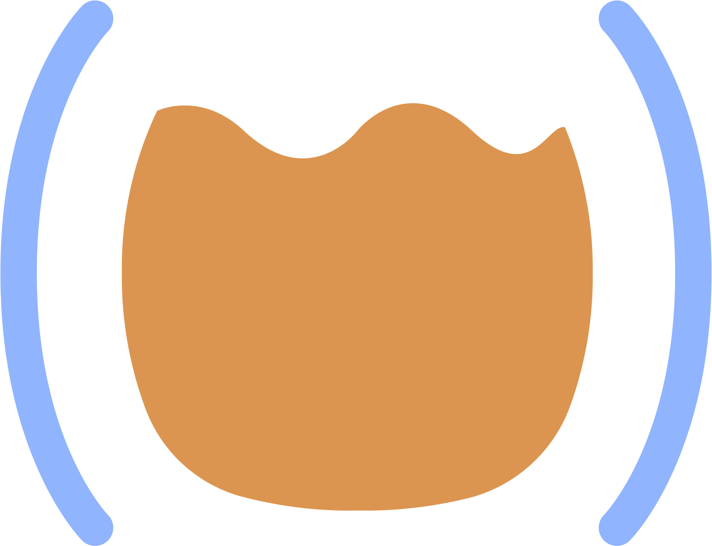

# Ask me Anything

## Conversation Cards

* History of Calva?
* Sponsoring?
* Is it always all fun?

## Calva

* Getting Started REPL – https://calva.io/getting-started
* https://calva.io
* https://github.com/BetterThanTomorrow/calva/wiki
* [tao.calva.io](https://tao.calva.io)

## ”Slides”
* https://github.com/PEZ/seajure

  

    
  

---

[Start](hello.md) > [VS Code](vscode.md) > [Calva](calva.md) > [Tao of Calva](tao-of-calva.md) > [Development](calva-dev.md) > [AMA](ama.md)