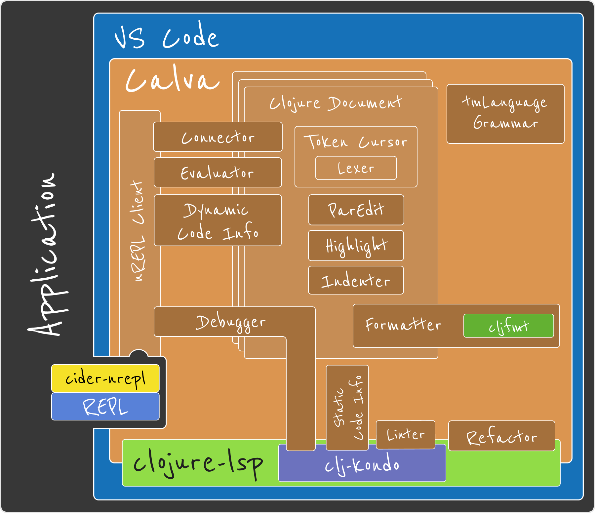

# Developing Calva

  

* Start here:
  * Clojurians Slack – #calva
  * https://github.com/BetterThanTomorrow/calva/wiki
* Steps:
  1. Fork, clone
  1. Start build task (<kbd>cmd</kbd>+<kbd>shift</kbd>+<kbd>b</kbd>)
  1. Jack in
  1. Start Development Extension Host (<kbd>F5</kbd>)
* TypeScript Changes
  * Debugger
  * Restart Development Extension Host
* ClojureScript Changes
  * REPL
  * No restarting!

  

  

    
  

---

[Start](hello.md) > [VS Code](vscode.md) > [Calva](calva.md) > [Tao of Calva](tao-of-calva.md) > [Development](calva-dev.md) > [Clojure Document](clojure-document.md) > [AMA](ama.md)