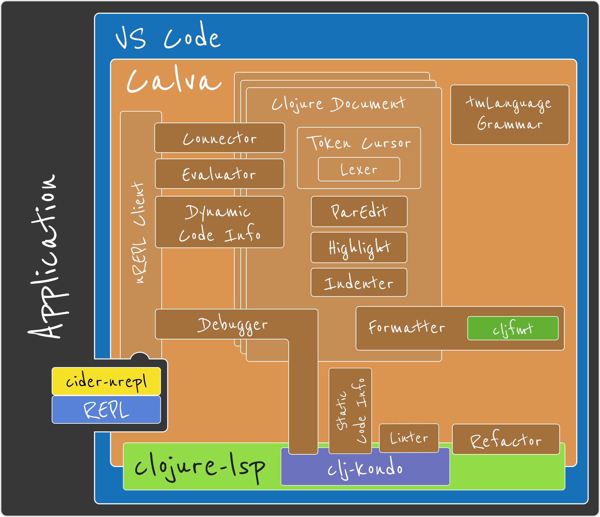

  

## Calva Conceptual Overview

* Calva, a VS Code Extension

  

  

    

      
    

  

---

[Start](hello.md) > [Clojure](clojure.md) > [Calva](calva.md) > [ClojureScript](cljsrn.md) > [Moar?](moar.md)