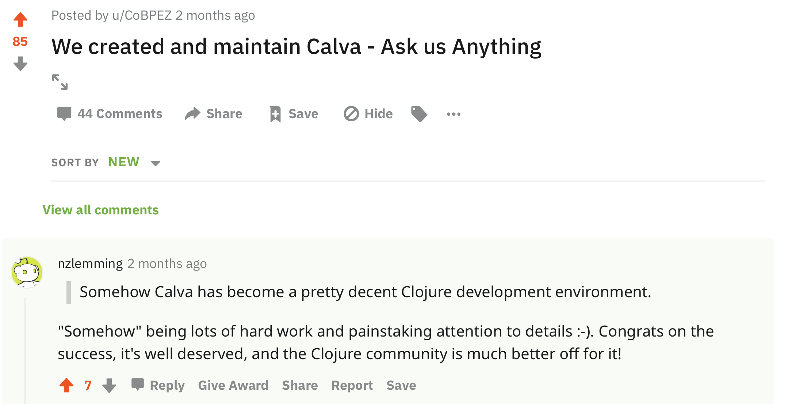

## Leveraging Clojure Developer Ergonomics

* Calva, a VS Code Extension
* Key features
  * Interactive programming
  * Getting started
    * Jack-in
  * Structural editing
    * No Parinfer
  * Custom REPL Commands
  * LiveShare
  * Generally complete and turnkey
* Why VS Code?
  * Lightweight is good because Calva can only connect one project at a time
* How did Calva come to be?
  * Sourcing from tons of open source hours
* Why is Calva maintained?
  * Who is it for?
  * The Tao of Calva
  * Who are maintaining it?
* Stewardship
  * Differing expectations
  * Openness to suggestions
  * We maintain, so we make the calls
  * Our expectation on the users: Treat it as the gift it is
    * Bonus points for encouragements
    * Golden stars in heaven for contributions
  * Clear communication
  * Good Documentation
* Development
  * Make it easy to contribute
  * Make it maintainable
  * Documentation First
    * https://github.com/BetterThanTomorrow/calva/issues/282
    * https://calva.io/connect-sequences/
  * Dev Tooling Community
    * The Orchard
      * nrepl, cider-nrepl
    * All those borkdudes
      * clj-kondo
      * edamame
      * sci
    * clojure-lsp
    * rewrite-clj
    * cljfmt
    * Common interest
      
  * Architecture
    * nrepl, bencode
    * clojure-lsp
    * cljfmt
    * tmLanguage grammar
    * The Output/REPL Window
    * Clojure Document
      * Mirror and Edit
      * Lexer
      * Token Cursor
      * Current Form
      * Current Top Level Form
      * Paredit
      * Calva Highlight
    * unit tests
    * integration tests
  * Painpoints
    * Windows
    * TypeScript + ClojureScript
* What I want you to do now
  * Try Calva
    * Explore the Getting Started REPL
    * See how/if Calva works for your project(s)
    * Help a Clojure newcomer get started using Calva
      * Let us know how it turned out, what was good and what was strange
